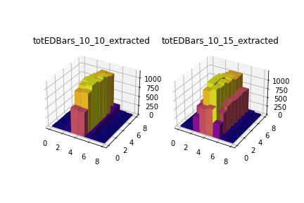

# Naming of generated files

## *NOTE*
- Upon the discovery that ALL of the Geant data was wrong (see the figures in the figures directory), all of the geant data was deleted due to being cluttering. This allowes this direcotry to be renamed to reflect the useable data contained within, the Gate data

***
- All of this is obsolete now
## Geant Bars
The name of each file totEDBars\_#\_#.txt signifies the shape of the beam hitting the detector. The beam is a rectangle centered on the detector with a length and width defined by the first and second numbers respectively. The second number gives the thickness of the beam which is shows up as more pixels being activated on the detector. It gets wider

## Geant Cubes
Same naming scheme as the bars, The beam follows the same order as the bars.

- Example of totEDCubes:

`0 0 0 2.49451
1 0 0 3.13366
2 0 0 0.818008
3 0 0 1.78182
4 0 0 0.0120127
5 0 0 1.19679`

- Col1: CubeID in dimension x
- Col2: CubeID in dimension y
- Col3: cubeID in dimension z
- Col4: Energy Deposition in the specific cube