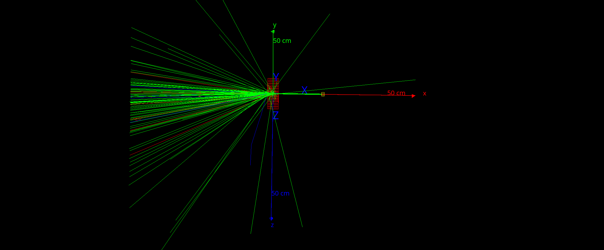
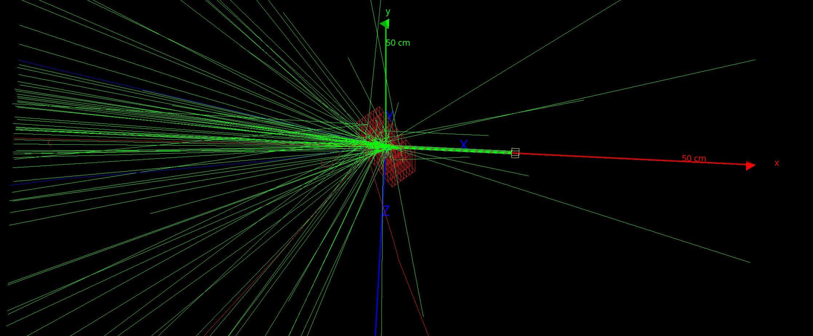

# Simulation Directory
Here is where the simulations will live and be developed, Ultimately I will need two of them. One will be for the bars and the other will be for the cubes.
I may put them in the same file and comment out sections that change but I think it would be better to completely write separate one and use the same material files and stuff. Just the .mac file will change.

## Structure
- Put each simulation in its own root directory identified with its name if its modeling bars or cubes. 
    - There shouldn't be a need for version numbers since we are using git!!!

## Detector Rotation
The first time this project was started the detector remained fixed and the incoming beam did not travel skew to the faces. This time the beam sizes change like normal but the detector rotates with steps of $20^{\circ}$. This process is exhaustive of permutations so every beam size will get every degree of rotation.

<figure>
    <center>
        
        <figcaption> This picture is the beam head on to the detector with $0^{\circ}$ of rotation </figcaption>
    </center>
</figure>

<figure>
    <center>
        
        <figcaption> This picture is of the beam penetrating the detector which has been rotated $40^{\circ}$ </figcaption>
    </center>
</figure>


        
## Configuration
```
[G4] 
[G4] **************************************************************
[G4]  Geant4 version Name: geant4-10-06-patch-03    (6-November-2020)
[G4]                        Copyright : Geant4 Collaboration
[G4]                       References : NIM A 506 (2003), 250-303
[G4]                                  : IEEE-TNS 53 (2006), 270-278
[G4]                                  : NIM A 835 (2016), 186-225
[G4]                              WWW : http://geant4.org/
[G4] **************************************************************
[G4] 
[Core-0] Initialization of geometry
[Core-0] Initialization of physics
[Core-0] Initialization of actors
[Core-0] 
[Core-0] *************************************************
[Core-0]  GATE version 9.0 (March 2020)
[Core-0]  Copyright : OpenGATE Collaboration
[Core-0]  Reference : Phys. Med. Biol. 49 (2004) 4543-4561
[Core-0]  Reference : Phys. Med. Biol. 56 (2011) 881-901
[Core-0]  Reference : Med. Phys. 41(6)    (2014)
[Core-0]  http://www.opengatecollaboration.org        
[Core-0] *************************************************
[Core-0] 
[Core-0] You are using Geant4 version 10.6.3
```